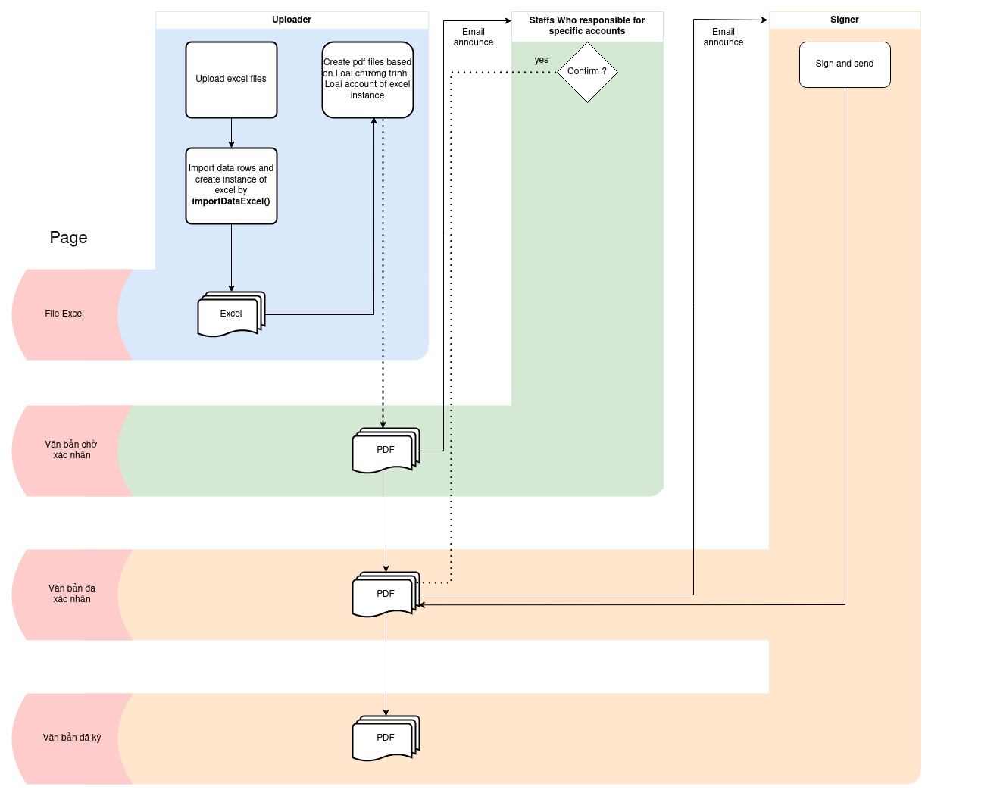

# Table of Contents

1. [Features](#features)
2. [Flowchart](#flowchart)
3. [Getting Started](#getting-started)
    - [Installation](#installation)
    - [Configuration](#configuration)
        1. [settings.py](#1-settingspy)
        2. [.env file](#2-env-file)
        3. [celery](#3-celery)
4. [How to support client](#how-to-support-client)    
5. [References](#references)    
  
# Features
    - Sign and send pdf files
    - Import excel file datas and store it
    - Email annouce
    - Auto monthly report


# Flowchart



# Getting started
Required
* Python 3.8.10
### Installation


```
pip install -r requirements.txt
```

```
pip install --upgrade pip
pip install -U PyMuPDF
```
There is a package named fitz on PyPI. Because PyMuPDF uses the same name, fitz, as its top-level text, both packages cannot co-exist in the same Python - except with the aforementioned change.

### Configuration
### 1. settings.py  
<bold>Put this in Kctool folder</bold>

```python 
"""
Django settings for Kctool project.

Generated by 'django-admin startproject' using Django 4.1.

For more information on this file, see
https://docs.djangoproject.com/en/4.1/topics/settings/

For the full list of settings and their values, see
https://docs.djangoproject.com/en/4.1/ref/settings/
"""

from pathlib import Path
import os
from django.urls import reverse_lazy
from decouple import config
# Build paths inside the project like this: BASE_DIR / 'subdir'.
BASE_DIR = Path(__file__).resolve().parent.parent
TEMPLATE_DIR = os.path.join(BASE_DIR, "templates")
LOGGING_DIR = os.path.join(BASE_DIR, "logging")
STATIC_URL = '/static/'
STATICFILES_DIRS = (
os.path.join(BASE_DIR, "static"),

)
# Quick-start development settings - unsuitable for production
# See https://docs.djangoproject.com/en/4.1/howto/deployment/checklist/


# CELERY BROKER RABBITMQ
CELERY_BROKER_URL = 'amqp://localhost'
# If time zones are active (USE_TZ = True) define your local CELERY_TIMEZONE = 'Asia/Ho_Chi_Minh'
CELERY_TIMEZONE = 'Asia/Ho_Chi_Minh'
# Let's make things happen
CELERY_BEAT_SCHEDULE = {}
CELERY_IMPORTS = ("excelExtract.tasks",)
# Application definition

INSTALLED_APPS = [

    'django.contrib.admin',
    'django.contrib.auth',
    'django.contrib.contenttypes',
    'django.contrib.sessions',
    'django.contrib.messages',
    'django.contrib.staticfiles',
    
    #   native apps
    "excelExtract.apps.ExcelextractConfig",
    "user.apps.UserConfig",

    #   third party apps
    'rest_framework',
    'django_celery_beat',
]

X_FRAME_OPTIONS = 'SAMEORIGIN'

MIDDLEWARE = [
    'django.middleware.security.SecurityMiddleware',
    'django.contrib.sessions.middleware.SessionMiddleware',
    'django.middleware.common.CommonMiddleware',
    'django.middleware.csrf.CsrfViewMiddleware',
    'django.contrib.auth.middleware.AuthenticationMiddleware',
    'django.contrib.messages.middleware.MessageMiddleware',
    'django.middleware.clickjacking.XFrameOptionsMiddleware',
]

ROOT_URLCONF = 'Kctool.urls'

LOGGING = {
    'version': 1,
    'disable_existing_loggers': False,
    'formatters': {
        'verbose': {
            'format': '{levelname} {asctime} {module} {message}',
            'style': '{',
        },
        'simple': {
            'format': '{levelname} {message}',
            'style': '{',
        },
    },
    'handlers': {
        'file': {
            'level': 'DEBUG',
            'class': 'logging.FileHandler',
            'filename': os.path.join(LOGGING_DIR,'logs.log'),
            'formatter': 'verbose',
        },
        'login_track': {
            'level': 'INFO',
            'class': 'logging.FileHandler',
            'filename': os.path.join(LOGGING_DIR,'login_track.log'),
            'formatter': 'simple',
        },
    },
    'loggers': {
        'django': {
            'handlers': ['file'],
            'level': 'ERROR',
            'propagate': True,
        },
        'django.request': {
            'handlers': ['file'],
            'level': 'ERROR',
            'propagate': True,
        },
        'debug_purposes': {
            'handlers': ['file'],
            'level': 'DEBUG',
            'propagate': True,
        },
        'login_track': {
            'handlers': ['login_track'],
            'level': 'INFO',
            'propagate': True,
        },'bot_tele_log': {
            'handlers': ['file'],
            'level': 'DEBUG',
            'propagate': True,
        },
    'auto_email': {
            'handlers': ['file'],
            'level': 'DEBUG',
            'propagate': True,
        },
        
    'read_excel': {
            'handlers': ['file'],
            'level': 'DEBUG',
            'propagate': True,
        },
    },
}
TEMPLATES = [
    {
        'BACKEND': 'django.template.backends.django.DjangoTemplates',
        'DIRS': [TEMPLATE_DIR,],
        'APP_DIRS': True,
        'OPTIONS': {
            'context_processors': [
                'django.template.context_processors.debug',
                'django.template.context_processors.request',
                'django.contrib.auth.context_processors.auth',
                'django.contrib.messages.context_processors.messages',
            ],
        },
    },
]

WSGI_APPLICATION = 'Kctool.wsgi.application'


# Password validation
# https://docs.djangoproject.com/en/4.1/ref/settings/#auth-password-validators

AUTH_PASSWORD_VALIDATORS = [
    {
        'NAME': 'django.contrib.auth.password_validation.UserAttributeSimilarityValidator',
    },
    {
        'NAME': 'django.contrib.auth.password_validation.MinimumLengthValidator',
    },
    {
        'NAME': 'django.contrib.auth.password_validation.CommonPasswordValidator',
    },
    {
        'NAME': 'django.contrib.auth.password_validation.NumericPasswordValidator',
    },
]


# Internationalization
# https://docs.djangoproject.com/en/4.1/topics/i18n/

LANGUAGE_CODE = 'en-us'

TIME_ZONE = 'Asia/Ho_Chi_Minh'

USE_I18N = True

USE_TZ = True
EMAIL_BACKEND = 'django.core.mail.backends.filebased.EmailBackend'
EMAIL_FILE_PATH = '/email_files/files/files.text' 


# redirect to next page when log out
LOGOUT_REDIRECT_URL = reverse_lazy("user:login")


# Default primary key field type
# https://docs.djangoproject.com/en/4.1/ref/settings/#default-auto-field

DEFAULT_AUTO_FIELD = 'django.db.models.BigAutoField'


# install smtp email
EMAIL_USE_TLS = config('EMAIL_USE_TLS', cast=bool)
EMAIL_HOST = config('EMAIL_HOST')
EMAIL_HOST_USER = config('EMAIL_HOST_USER')
EMAIL_HOST_PASSWORD = config('EMAIL_HOST_PASSWORD')
EMAIL_PORT = config('EMAIL_PORT', cast=int)

AUTH_USER_MODEL = 'user.User'

ALLOWED_HOSTS = ['*']

# SECURITY WARNING: keep the secret key used in production secret!
SECRET_KEY = config("SECRET_KEY",cast=str)

# SECURITY WARNING: don't run with debug turned on in production!
DEBUG = config("DEBUG")


# Database
# https://docs.djangoproject.com/en/4.1/ref/settings/#databases

DATABASES = {
    'default': {
        'ENGINE': 'django.db.backends.sqlite3',
        'NAME': BASE_DIR / 'db.sqlite3',
    }
}


URL= config("URL",cast=str)        
            
```
### 2. .env file

<bold>Put this in same dir with manage.py </bold>
```
EMAIL_USE_TLS = True
EMAIL_HOST = smtp.office365.com
EMAIL_HOST_USER = noreply@pvs.com.vn
EMAIL_HOST_PASSWORD = OFwde611
EMAIL_PORT = 587

DEBUG = True
SECRET_KEY = django-insecure-kl!zq0&z444x3!3k4n7%=q++)ft*35f@&o^n#msm9l+&+lo0nh

URL = http://127.0.0.1:8000
```

### 3. celery
We will run celery worker in background following this documentation 
[Daemonizing Celery](https://docs.celeryq.dev/en/stable/userguide/daemonizing.html)

* Product https://psign.kcvn.vn/ is using supervisord for daemons


# How to support client
## 1. Change staff who repsonsible for specific account
Goto Excelextract > Excel accounts  in Adminsite

Fint exact account and change ResponsibleBy:
## 2. Change/remove email that need to annouced
I suggest that goto Excelextract > Account emails
If client want to change , then change the email 
<bold> Do not</bold> remove the data, please only change email or set to  None 

# References
* [FPDF Tutorial](https://youtube.com/playlist?list=PLHCU7DCP4jhxnxV4Ub4YDqWiZ061t183c&si=UbDJpI6saEukZeCR)
* [HOW I Wrap cell's content in exportFiles](https://www.youtube.com/watch?v=utjJe90MeEw&t=13s)

* [Celery 5.2.7](https://docs.celeryq.dev/en/v5.2.7/index.html)


---
Viewpages
---
    kcToolPage     -->index.html
    newCreatedDocs -->vb-cho-xac-nhan.html
    confirmedDocs  -->vb-da-xac-nhan.html
    signedDocs     -->vb-da-ky.html
    untrackedDocs  -->vb-chua-duoc-quan-ly.html 
    staffManager   -->quan-ly-nhan-su.html
    accountUpdate
    addNewProfile
    deletedDocs
---
api_view
---
    create_pdf
    getListAccount
    confirm_pdf
    sign_and_send_pdf
    send_pdf
    deleteFile
    deleteExcelFile
    restoreFile
    downloadFiles
    updateProfile
    update_profile
---
Generate virtual file
---
    export_hnk_ticket_excel

# Last words
Message to the one coming after me: If you are a former employee, please skip; otherwise, read on . This is the first app I've ever created; I lacked experience and guidances. During the development of the app, I tried my best, but it seems like no one cared about the product's quality, even though it went through testing and product validation processes. The codebase has poorly named variables and lacks a coding convention will make you stress (Im really sorry about this). I wanted to make changes, but time constraints didn't allow it , i have about 5 days to make document and edit things in codebase , try to make it more clear :(( . Therefore, here are my observations: the logic of this app is becoming more flawed each day due to the inconsistency in the Excel files being imported, and partly because of the relationships between tables, making it challenging to make edits. I hope reading this markdown file will help you (or not :D) understand what I did so that you don't have to guess or read through the codebase from scratch. I hope you can make this app more widely applicable because, without any changes, I think it might get removed, at least that's my guess :D.Happy coding!!
